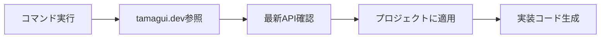

# Claude カスタムコマンド

このディレクトリにはTamaguiを使った画面実装を効率化するためのカスタムコマンドが含まれています。

## 利用可能なコマンド

### 1. /create-screen
自然言語で記述するだけで画面全体の実装を行う。Tamaguiドキュメントを参照しながら最適な実装を自動生成。

**自然言語での使用（推奨）：**
```bash
/create-screen チャット画面を作って
/create-screen ルーム一覧を表示する画面
/create-screen メッセージを送信できるフォーム
```

**従来形式（互換性のため維持）：**
```bash
/create-screen ChatScreen chat
```

### 2. /tamagui-component
特定のコンポーネントの実装を行う際に使用。

```bash
/tamagui-component Card room-item
```

### 3. /tamagui-fetch
Tamaguiドキュメントから最新情報を取得。

```bash
/tamagui-fetch animations
```

### 4. implement-screen.sh
画面実装の対話的ヘルパースクリプト。

```bash
./implement-screen.sh RoomList list
```

### 5. command-utils
コマンド間の連携と共通機能を提供するユーティリティ（内部利用）

## 🔄 コマンド連携機能

### 自動連携の仕組み
`/create-screen` コマンドは他のコマンドと**自動連携**して最適な実装を生成します：

```mermaid
graph LR
    A[/create-screen チャット画面] --> B[自動実行]
    B --> C[/tamagui-fetch chat]
    B --> D[/tamagui-component MessageBubble]
    B --> E[/tamagui-component MessageInput]
    C --> F[統合された画面生成]
    D --> F
    E --> F
```

### 連携の例
**入力:**
```bash
/create-screen チャット画面を作って
```

**内部で自動実行されるコマンド:**
1. `/tamagui-fetch chat` - 最新のチャットUIパターン取得
2. `/tamagui-component MessageBubble chat-message` - メッセージバブル生成
3. `/tamagui-component MessageInput chat-input` - 入力欄生成
4. `/tamagui-component DateDivider date-separator` - 日付区切り生成

**結果:** 全てが統合された`ChatScreen.tsx`が生成される

### 画面タイプ別の自動生成コンポーネント

| 画面タイプ | 自動生成されるコンポーネント |
|-----------|---------------------------|
| **chat** | MessageBubble, MessageInput, DateDivider, Avatar |
| **list** | Card, EmptyState, SearchBar, Spinner |
| **form** | Input, Select, Button, ErrorText |
| **detail** | Card, Button, Tabs, Sheet |

## 使用フロー

1. **新規画面を作成する場合（連携機能により簡単に）**
   ```bash
   # これだけで全て自動実行！
   /create-screen チャット画面を作って
   
   # 内部で自動的に以下が実行される：
   # - /tamagui-fetch で最新ドキュメント取得
   # - /tamagui-component で必要なコンポーネント生成
   # - 全てを統合して画面を生成
   ```

2. **既存画面を改善する場合**
   ```
   1. /tamagui-fetch performance で最適化方法を確認
   2. 該当するコンポーネントを修正
   ```

3. **コンポーネントを追加する場合**
   ```
   1. /tamagui-component <コンポーネント> <用途> で生成
   2. 既存のパターンに合わせて調整
   ```

## Tamaguiドキュメント参照時の流れ



## プロジェクト固有の設定

CLAUDE.mdに定義された設計書に基づいて、以下の点を考慮：

- **データモデル**: Room, Messageテーブル構造
- **画面構成**: ルーム一覧、チャット画面など
- **コンポーネント設計**: Smart/Dumbコンポーネントの分離
- **カスタムフック**: useRooms, useMessagesなど

## Tips

### パフォーマンス最適化
- FlashListを使用した大量データの表示
- React.memoによる再レンダリング防止
- useMemoによる計算結果のキャッシュ

### テーマ対応
- Tamaguiのトークンシステムを活用
- ルームごとのカラーテーマ切り替え
- ダークモード対応

### アクセシビリティ
- 適切なaccessibilityRole設定
- キーボードナビゲーション対応
- スクリーンリーダー対応

## トラブルシューティング

### よくある問題

1. **コンポーネントが表示されない**
   - Themeプロバイダーの確認
   - import文の確認

2. **アニメーションが動作しない**
   - animation propの設定確認
   - enterStyle/exitStyleの確認

3. **スタイルが適用されない**
   - トークンの使用確認
   - Theme設定の確認

### デバッグ方法

```typescript
// デバッグ用のログ出力
if (__DEV__) {
  console.log('Component props:', props);
}
```

## 更新履歴

- 2025-08-21: 初版作成
  - カスタムコマンド群の整備
  - Tamaguiドキュメント参照機能の追加
  - `/create-screen` コマンドの自然言語対応
    - 日本語での画面作成依頼に対応
    - キーワードから画面タイプを自動推測
    - 画面名の自動生成機能
  - **コマンド連携機能の実装**
    - `/create-screen` が `/tamagui-fetch` と `/tamagui-component` を自動実行
    - 画面タイプに応じた最適なコンポーネントセットを自動生成
    - 共通ユーティリティ `command-utils.md` の追加