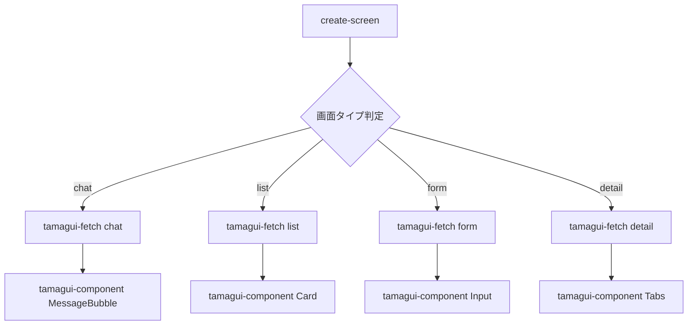

# command-utils

カスタムコマンド間の連携と共通機能を提供するユーティリティ

## コマンド連携システム

### 連携可能なコマンド
- `/create-screen` - 画面全体の実装
- `/tamagui-component` - 個別コンポーネントの実装
- `/tamagui-fetch` - Tamaguiドキュメントからの情報取得

## 連携パターン

### 1. 画面作成時の自動連携


### 2. コンポーネント間の依存関係
```typescript
// 画面タイプごとの必要コンポーネントマッピング
const screenComponents = {
  chat: [
    'MessageBubble',
    'MessageInput',
    'DateDivider',
    'Avatar'
  ],
  list: [
    'Card',
    'EmptyState',
    'SearchBar',
    'Spinner'
  ],
  form: [
    'Input',
    'Select',
    'Button',
    'ErrorText'
  ],
  detail: [
    'Card',
    'Button',
    'Tabs',
    'Sheet'
  ]
}
```

## 共通解析ロジック

### 画面タイプ推測アルゴリズム
```typescript
function detectScreenType(naturalLanguage: string): ScreenType {
  const keywords = {
    chat: ['チャット', 'メッセージ', '会話', '送信', 'トーク'],
    list: ['一覧', 'リスト', '表示', '並べる', 'カード'],
    form: ['フォーム', '入力', '作成', '編集', '登録'],
    detail: ['詳細', 'プロフィール', '情報', '確認']
  }
  
  // キーワードマッチングロジック
  for (const [type, words] of Object.entries(keywords)) {
    if (words.some(word => naturalLanguage.includes(word))) {
      return type as ScreenType
    }
  }
  
  return 'list' // デフォルト
}
```

### 画面名生成ロジック
```typescript
function generateScreenName(naturalLanguage: string): string {
  // 日本語から英語名への変換マッピング
  const nameMap = {
    'チャット': 'Chat',
    'ルーム': 'Room',
    'メッセージ': 'Message',
    'ユーザー': 'User',
    'プロフィール': 'Profile',
    '設定': 'Settings',
    '一覧': 'List',
    'フォーム': 'Form',
    '詳細': 'Detail'
  }
  
  // キーワード抽出と変換
  let screenName = ''
  for (const [jp, en] of Object.entries(nameMap)) {
    if (naturalLanguage.includes(jp)) {
      screenName += en
    }
  }
  
  return screenName + 'Screen'
}
```

## コマンド実行順序

### 最適な実行順序
1. **情報収集フェーズ**
   - `/tamagui-fetch` で最新ドキュメント取得
   - プロジェクトの既存パターン分析

2. **コンポーネント生成フェーズ**
   - 必要な `/tamagui-component` を並列実行
   - 依存関係を考慮した順序で生成

3. **統合フェーズ**
   - 生成されたコンポーネントを統合
   - 画面全体の構造を構築

## 共有データ構造

### コマンド間で共有する情報
```typescript
interface SharedContext {
  // 画面情報
  screenType: 'chat' | 'list' | 'form' | 'detail'
  screenName: string
  naturalLanguageInput: string
  
  // Tamaguiドキュメント情報
  fetchedDocs: {
    component: string
    url: string
    content: string
    bestPractices: string[]
  }[]
  
  // 生成されたコンポーネント
  generatedComponents: {
    name: string
    path: string
    type: string
    props: string[]
  }[]
  
  // プロジェクト情報
  projectContext: {
    existingPatterns: string[]
    theme: string
    dependencies: string[]
  }
}
```

## エラーハンドリング

### 連携失敗時の処理
```typescript
function handleIntegrationError(error: Error, context: SharedContext) {
  // フォールバック処理
  if (error.message.includes('tamagui-fetch failed')) {
    // ローカルのデフォルトパターンを使用
    return useDefaultPatterns(context.screenType)
  }
  
  if (error.message.includes('component generation failed')) {
    // 基本的なコンポーネントテンプレートを使用
    return useBasicTemplate(context.screenType)
  }
  
  // それ以外のエラーは上位に伝播
  throw error
}
```

## パフォーマンス最適化

### 並列実行戦略
- 独立したコンポーネントは並列で生成
- ドキュメント取得は必要最小限に
- キャッシュを活用して重複取得を防ぐ

### キャッシュ戦略
```typescript
const cache = {
  docs: new Map(), // ドキュメントキャッシュ
  components: new Map(), // コンポーネントキャッシュ
  ttl: 15 * 60 * 1000 // 15分
}
```

## 使用例

### 基本的な連携
```bash
# ユーザー入力
/create-screen チャット画面を作って

# 内部実行
1. detectScreenType("チャット画面を作って") → "chat"
2. generateScreenName("チャット画面を作って") → "ChatScreen"
3. /tamagui-fetch chat
4. /tamagui-component MessageBubble chat-message
5. /tamagui-component MessageInput chat-input
6. 統合してChatScreen.tsxを生成
```

### 詳細指定での連携
```bash
# ユーザー入力
/create-screen リアルタイムで更新されるメッセージリスト

# 内部実行
1. 複数キーワード検出 → "chat" + "list"のハイブリッド
2. 両方のコンポーネントセットを取得
3. 最適な組み合わせを生成
```

## 今後の拡張予定

- コマンド間のより密な連携
- AIによる最適化提案
- プロジェクト全体の一貫性チェック
- 自動テスト生成との連携