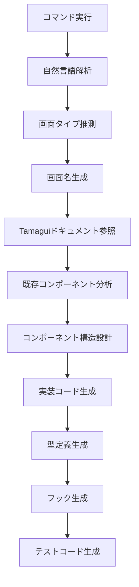

# create-screen

自然言語で記述するだけで、Tamaguiドキュメントを参照し最適な画面実装を生成するコマンド

## 使用方法
```
/create-screen <自然言語での説明>
```

## 自然言語での使用例
- `/create-screen チャット画面を作って`
- `/create-screen ルーム一覧を表示する画面`
- `/create-screen メッセージを送信できるフォーム`
- `/create-screen ユーザーのプロフィール詳細画面`
- `/create-screen 設定を編集する画面`
- `/create-screen 画像を選択してアップロードするフォーム`

## 従来形式（互換性のため維持）
- `/create-screen ChatScreen chat` - チャット画面の実装
- `/create-screen RoomList list` - リスト画面の実装
- `/create-screen RoomForm form` - フォーム画面の実装
- `/create-screen Profile detail` - 詳細画面の実装

## 自然言語解析

### 画面タイプの自動推測
自然言語から以下のキーワードを検出し、適切な画面タイプを推測します：

| 画面タイプ | キーワード | 例 |
|-----------|----------|----|
| **chat** | チャット、メッセージ、会話、送信、トーク、コメント | 「チャット画面」「メッセージを送る」 |
| **list** | 一覧、リスト、表示、並べる、カード、グリッド、検索 | 「ルーム一覧」「商品を表示」 |
| **form** | フォーム、入力、作成、編集、登録、送信、投稿、設定 | 「登録フォーム」「設定を編集」 |
| **detail** | 詳細、プロフィール、情報、確認、プレビュー | 「詳細画面」「プロフィール表示」 |

### 画面名の自動生成
自然言語から適切な画面名を生成します：

| 入力例 | 生成される画面名 |
|-------|----------------|
| チャット画面 | ChatScreen |
| ルーム一覧 | RoomListScreen |
| メッセージ送信フォーム | MessageFormScreen |
| ユーザープロフィール | UserProfileScreen |
| 設定画面 | SettingsScreen |

## 実行内容

1. **Tamaguiドキュメントの参照（自動連携）**
   - `/tamagui-fetch` を内部実行して最新情報を取得
   - https://tamagui.dev/ui/intro から最新のコンポーネント情報を取得
   - 画面タイプに応じた適切なコンポーネントを選択

2. **画面構造の分析**
   - CLAUDE.mdの設計書を参照
   - 既存コンポーネントのパターンを分析
   - 再利用可能なコンポーネントの特定

3. **必要なコンポーネントの自動生成（自動連携）**
   - `/tamagui-component` を内部実行して個別コンポーネントを生成
   - 画面タイプに応じた最適なコンポーネントセットを選択
   - 統一されたデザインシステムの適用

4. **最適な実装の提案と生成**
   - Tamaguiのベストプラクティスを適用
   - パフォーマンス最適化（React.memo、useMemo等）
   - アクセシビリティ対応
   - レスポンシブデザイン
   - テーマ対応

5. **実装するコンポーネント**
   - Container Component（ロジック）
   - Presentational Component（表示）
   - カスタムフック
   - 型定義

## 🔄 他コマンドとの連携

### 自動連携機能
`/create-screen` コマンドは以下のコマンドと自動連携します：

#### `/tamagui-fetch` との連携
- 画面タイプに応じた最新ドキュメントを自動取得
- 例：chat画面 → `/tamagui-fetch chat` を内部実行

#### `/tamagui-component` との連携
- 必要なコンポーネントを自動生成
- 例：chat画面の場合
  - `/tamagui-component MessageBubble chat-message`
  - `/tamagui-component MessageInput chat-input`
  - `/tamagui-component DateDivider chat-divider`

### 連携フロー例
```mermaid
graph LR
    A[/create-screen チャット画面] --> B[画面タイプ: chat]
    B --> C[/tamagui-fetch chat]
    C --> D[最新Chat UIパターン取得]
    D --> E[/tamagui-component MessageBubble]
    E --> F[/tamagui-component MessageInput]
    F --> G[統合された画面生成]
```

## 画面タイプ別の実装パターンと連携コンポーネント

### list（リスト画面）
**実装パターン:**
- FlashListを使用した高速スクロール
- 仮想化による大量データ対応
- プルリフレッシュ
- 無限スクロール
- EmptyState対応

**自動生成されるコンポーネント:**
- `/tamagui-component Card list-item`
- `/tamagui-component EmptyState no-data`
- `/tamagui-component SearchBar list-search`
- `/tamagui-component Spinner loading`

### form（フォーム画面）
**実装パターン:**
- バリデーション
- エラー表示
- キーボード対応
- 送信状態管理

**自動生成されるコンポーネント:**
- `/tamagui-component Input form-field`
- `/tamagui-component Select form-select`
- `/tamagui-component Button submit-button`
- `/tamagui-component ErrorText validation-error`

### chat（チャット画面）
**実装パターン:**
- メッセージリスト（逆順表示）
- 入力エリア
- 自動スクロール
- 日付区切り

**自動生成されるコンポーネント:**
- `/tamagui-component MessageBubble chat-message`
- `/tamagui-component MessageInput chat-input`
- `/tamagui-component DateDivider date-separator`
- `/tamagui-component Avatar user-avatar`

### detail（詳細画面）
**実装パターン:**
- ヘッダー/ボディ構造
- アクションボタン
- タブ切り替え
- シェアシート

**自動生成されるコンポーネント:**
- `/tamagui-component Card detail-card`
- `/tamagui-component Button action-button`
- `/tamagui-component Tabs detail-tabs`
- `/tamagui-component Sheet share-sheet`

## 実装時のチェックリスト

- [ ] Tamaguiコンポーネントを適切に使用
- [ ] TypeScriptの型定義が完全
- [ ] パフォーマンス最適化済み
- [ ] アクセシビリティ対応
- [ ] テーマ・ダークモード対応
- [ ] エラーハンドリング実装
- [ ] ローディング状態の表示
- [ ] 既存パターンとの一貫性

## コマンド実行フロー



## 実装される内容

自然言語の説明から以下を自動生成します：

1. **画面コンポーネント** (src/app/)
2. **機能コンポーネント** (src/features/)
3. **カスタムフック** (src/features/*/hooks/)
4. **型定義** (src/features/*/types/)
5. **UIコンポーネント** (必要に応じて)

## 高度な使用例

### 複雑な要件の指定
```bash
# 検索機能付きのリスト
/create-screen 検索できるルーム一覧画面

# リアルタイムチャット
/create-screen リアルタイムでメッセージが更新されるチャット

# マルチステップフォーム
/create-screen 3ステップで登録するユーザー登録フォーム
```

### 日本語以外の対応
```bash
# 英語
/create-screen create a chat interface

# 混在
/create-screen messageをsendするform画面
```

## 注意事項

- 常に最新のTamaguiドキュメントを参照すること
- 既存のコンポーネントパターンを優先すること
- パフォーマンスを意識した実装を行うこと
- アクセシビリティを忘れないこと
- 自然言語が曖昧な場合は、最も適切と思われる画面タイプを選択